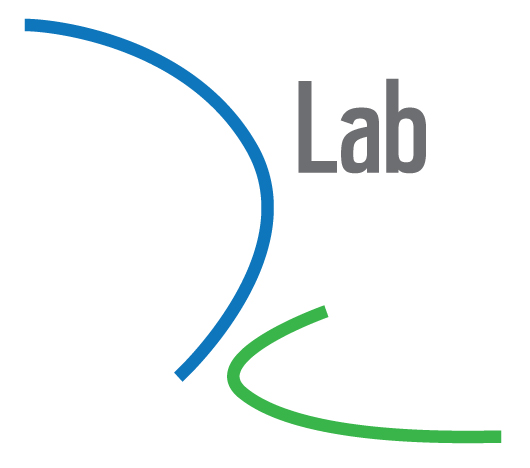

# Computational text analysis

## Overview

This workshop will equip newcowers with the foundation for applying computational text analysis methods in their work. The focus is on high-level descriptions of what existing methods do and user-friendly implementations. We will also spend some time on interpreting results correctly.

## What you'll learn
* what computational text analysis can do, and what it can't do
* preprocessing text data
* supervised methods
* unsupervised methods
* where to go next to learn and seek help with your computational text analysis projects

## Prerequisites

For day 1, no experience in computational text analysis or programming is expected or required. The goal is to provide an orientation for those wishing to go further with text analysis and interpret results of these methods.

On days 2, 3 and 4, we will get our hands dirty implementing some of the methods. This will be in Python. If you would like to follow along with the implementation details, you will need some familiarity with Python. Completion of D-Lab's Python FUN!damentals workshop series is sufficient. If you haven't programmed in Python or at all, you are of course welcome to attend and learn the big ideas behind the methods.

## Getting started & software prerequisites

**We will cover the this in the first session. Please just come with a laptop and we'll talk about the rest on day 1.**

There are three ways to get started with these materials, with each of them requiring different software installed on your computer.

#### JupyterHub

If you're taking this workshop at D-Lab, then your instructor will have set up JupyterHub for your workshop. The JupyterHub allows you to run code on a remote computer but see the results on yours. For this method, the only software you need is a modern web browser (we suggest Google Chrome). Your instructor will give you a URL on the day. This is our recommended method.

#### Anaconda

If you want to run the code on your computer, you have two options. Both involve installing (or making sure you have installed) Python 3 and some additional libraries. [Anaconda](https://www.anaconda.com/what-is-anaconda/) is a **free** product that makes the installation process easy. It bundles together the Python language and a whole bunch of additional packages that we often rely on in our workshops. This way, you only have to download and install one thing. To use this method, visit [this site](https://www.anaconda.com/download/) and follow the instructions for your operating system to download the Python 3.x version (it might be 3.6, or 3.7, or higher). **Please, please, please download the 3.x version, not the Python 2.x version**. You may have a choice between using the graphical installer or the command line installer. Use whichever you're comfortable with, but the graphical one is easier.

#### For Pythonistas

If you've been using Python for a while, you might not want to use Anaconda. First, make sure you have a Python 3.x version. Second, install Jupyter by following [these instructions](http://jupyter.org/install). Third, install the packages listed in the `requirements.txt` file of this repo. The easiest way to do this is:

```
pip3 install -r requirements.txt
```

## IOKN2K

It's OK Not To Know! That's our motto at [D-Lab](http://dlab.berkeley.edu/). D-Lab is open to researchers and professionals from all disciplines and levels of experience.

## Resources

* [CTAWG (Computaitonal Texta Analsysis Working Group) website](http://dlabctawg.github.io)
* [Lectures from Stanford's NLP class](https://www.youtube.com/watch?v=nfoudtpBV68&list=PL6397E4B26D00A269)

## Contributing

If you spot a problem with these materials, please make an issue describing the problem.

## Acknowledgments

* [Ben Gebre-Medhin](http://gebre-medhin.com)
* [Laura Nelson](http://www.lauraknelson.com)
* [Teddy Roland](https://teddyroland.com/about/)
* [Geoff Bacon](http://linguistics.berkeley.edu/~bacon/)

These materials have evolved over a number of years. They were first developed for the [D-Lab](http://dlab.berkeley.edu) by Laura Nelson & Teddy Roland, with contributions and revisions made by Ben Gebre-Medhin, and most recently updated by Geoff Bacon.


